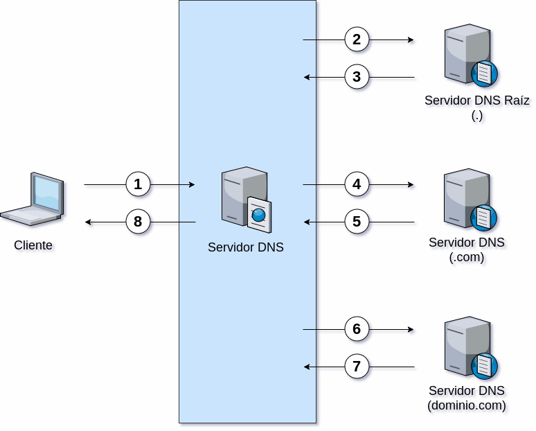

El **DNS** (por sus siglas en inglés _Domain Name System_) o **sistema de nombres de dominio** es un sistema de nomenclatura jerárquico descentralizado para dispositivos conectados a redes IP como Internet o una red privada.

!!!done "Uso del DNS"
		El servicio DNS se emplea fundamentalmente en la resolución de nombres, es decir, determinar cuál es la dirección IP que corresponde a un nombre de dominio determinado y viceversa. 

## Tipos de nombres de dominio DNS

* **_Root Domain_** o **Dominio raíz** es un dominio que se indica mediante un punto `(.)` y se encuentra en la raíz o el nivel más alto de la jerarquía de dominios. 

* **_Top Level Domains_ (TLD)** o **dominios de nivel superior** son aquellos que no pertenecen a otro dominio. [Existen varios tipos](https://es.wikipedia.org/wiki/Dominio_de_nivel_superior), entre los más importantes tenemos a: 

	- **ccTLD**	(del inglés, _country code top level domain_) o _dominio de nivel superior geográfico_, son dominios reservados para países o territorios independientes. Por ejemplo: `.ar` (Argentina), `.es` (España), `.uy` (Uruguay), etc.

	- **gTLD** (del inglés _general top level domain_) o _dominio de nivel superior genérico_, que mantiene la IANA (del inglés, _Internet Assigned Numbers Authoruty_). Por ejemplo: `.com` (comercial), `.gob` (gubernamental), `.edu` (educación), etc.  

* **_Domain Name_** o **nombre de dominio** es un nombre fácil de recordar asociado a una dirección IP. Se trata de un nombre único que se muestra después del signo `@` en las direcciones de correo electrónico y después de `www.` en las direcciones web. También puede entenderse como una sucesión de nombres concatenados por puntos, como por ejemplo: `dominio.com.ar`, `com.ar` y `ar`

* **_Host Name_** o **nombre de host** es una sola "palabra" que puede incluir letras, números y guiones. Por ejemplo: `www`, `blog` y `guia-educativa`. En ocasiones, coincide con el nombre del equipo. 

* **_Subdomain_** o **subdominio** forma parte de un dominio más grande. Por ejemplo, `itel.edu.ar` es un subdominio de `edu.ar`, que a su vez lo es del TLD `ar`

* **_Fully Qualified Host Name_ (FQHN)** o **nombre completo de un host**, está formado por el _hostname_, seguido de un punto y su correspondiente _nombre de dominio_. Por ejemplo, dada la computadora llamada `pc1` y el nombre de dominio `algo.com.`, el FQDN será `pc1.algo.com.`; a su vez, un FQDN asociado a `pc1` podría ser `biblioteca.pc1.algo.com.`. 

!!!info "Punto final"
		En los sistemas de nombre de dominio de zonas, y más especialmente en los FQDN, los nombres de dominio se especificarán con un punto `(.)` **al final del nombre**, aunque se puede omitir. Dicho punto indica el dominio raíz. 

## Arquitectura del DNS
El sistema DNS funciona principalmente en base al protocolo UDP. Los requerimientos se realizan a través del puerto 53.

* **Cliente DNS**: está instalado en el cliente (es decir, nosotros) y realiza peticiones de resolución de nombres a los servidores DNS.

* **Servidor DNS**: son los que contestan las peticiones y resuelven los nombres mediante un sistema estructurado en árbol. Las direcciones DNS que ponemos en la configuración de la conexión, son las direcciones de los Servidores DNS.

El sistema está estructurado en forma de “árbol“. Cada nodo del árbol está compuesto por un grupo de servidores que se encargan de resolver un conjunto de dominios (zona de autoridad). 

Un servidor puede delegar en otro (u otros) la autoridad sobre alguna de sus sub-zonas (esto es, algún subdominio de la zona sobre la que él tiene autoridad). Un subdominio puede verse como una especialización de un dominio de nivel anterior. 

## Terminología
Antes de proseguir, es necesario introducir algunos términos básicos para evitar confusiones y ambigüedades. 

* **Zona de autoridad** es una parte del espacio de nombre de dominios sobre la que es responsable un servidor DNS, que puede tener autoridad sobre varias zonas. En otras palabras, son bases de datos, distribuidas en servidores DNS especiales, en las que se almacenan los registros actualizados de cada dominio en el mundo. Estas zonas son autoritativas, en el sentido de que contienen la información oficial, reconocida y verídica de cada dominio.

!!! info "Servidores raíz"
		Los [_root servers_](http://www.root-servers.org/) o _servidores raíz_ tienen autoridad sobre el dominio raíz `(.)`, éstos rara vez cambian, siendo actualmente 13.

## Funcionamiento del DNS

La operación del _resolver_ se inicia cuando recibe un nombre y debe traducirlo. Para comenzar el proceso de traducción el resolver debe conocer uno o más servidores de nombres a quienes enviarles la consulta. Esta información se configura en cada máquina, colocando la dirección IP del servidor (por supuesto, no es posible usar el nombre en este lugar). La traducción completa se le pide al servidor local.

Para resolver una consulta, un servidor de nombres debe conocer a lo menos a los servidores raíz. De ese modo, si nunca ha oído hablar de ninguno de los dominios del nombre, puede preguntarle a un servidor raíz. Por lo menos, el servidor raíz tiene que conocer la lista de servidores del dominio de primer nivel del nombre (o sabe que no existe). Si sabe más que eso (por ejemplo, si es secundario del dominio de primer nivel) responde lo más posible. Las respuestas son de dos tipos: una lista de servidores de nombres que saben más que él (servidores del dominio o del sub-dominio) o una lista de direcciones IP que corresponden a la máquina buscada. 

1. Una aplicación (cliente) necesita resolver un FQHN y envía un requerimiento al servidor de nombres configurado en el sistema. Este servidor de nombres, normalmente, es el provisto por el ISP. En nuestro caso, será el servidor de nombres local que instalaremos y configuraremos. Este servidor local se conoce también como _resolver_.

2. El servidor de nombres consulta a uno de los servidores raíz (cuya dirección IP debe conocer previamente).

3. El servidor raíz devuelve el nombre del servidor a quien se le ha delegado la sub-zona.
    
4. El servidor inicial interroga al nuevo servidor.

5. El nuevo servidor que posee autoridad sobre la zona interrogada devuelve el nombre del servidor que posee el dominio buscado

6. El servidor DNS iniciar interroga al nuevo servidor con autoridad sobre la zona en cuestión

7. El nuevo servidor resuelve el nombre correspondiente, si este existe.

8. El servidor inicial informa al cliente el nombre resuelto.

## Tipos de servidores DNS

Estos son los tipos de servidores de acuerdo a su función:

* **Primarios o maestros**: guardan los datos de un espacio de nombres en sus ficheros.
* **Secundarios o esclavos**: obtienen los datos de los servidores primarios a través de una transferencia de zona.
* **Locales o caché**: funcionan con el mismo software, pero no contienen la base de datos para la resolución de nombres. Cuando se les realiza una consulta, estos a su vez consultan a los servidores DNS correspondientes, almacenando la respuesta en su base de datos para agilizar la repetición de estas peticiones en el futuro continuo o libre.

## Base de conocimiento
* [https://es.wikipedia.org/wiki/Sistema_de_nombres_de_dominio](https://es.wikipedia.org/wiki/Sistema_de_nombres_de_dominio)
* [http://es.tldp.org/Manuales-LuCAS/GARL2/garl2/x-087-2-resolv.howdnsworks.html](http://es.tldp.org/Manuales-LuCAS/GARL2/garl2/x-087-2-resolv.howdnsworks.html)
* [https://blog.smaldone.com.ar/2006/12/05/como-funciona-el-dns](https://blog.smaldone.com.ar/2006/12/05/como-funciona-el-dns/)
* [https://geekytheory.com/como-funciona-el-dns](https://geekytheory.com/como-funciona-el-dns)
* [https://users.dcc.uchile.cl/~jpiquer/Internet/DNS/node3.html](https://users.dcc.uchile.cl/~jpiquer/Internet/DNS/node3.html)
* [https://www.xatakamovil.com/conectividad/como-funciona-internet-dns](https://www.xatakamovil.com/conectividad/como-funciona-internet-dns)
* [https://support.google.com/a/answer/2573637](https://support.google.com/a/answer/2573637)
* [https://support.google.com/a/answer/48090?hl=es](https://support.google.com/a/answer/48090?hl=es)
* [https://technet.microsoft.com/es-ar/library/dd197446(v=ws.10).aspx](https://technet.microsoft.com/es-ar/library/dd197446(v=ws.10).aspx)
* [https://developer.mozilla.org/en-US/docs/Learn/Common_questions/What_is_a_domain_name](https://developer.mozilla.org/en-US/docs/Learn/Common_questions/What_is_a_domain_name)
* [http://www.ite.educacion.es/formacion/materiales/85/cd/linux/m2/servidor_dns.html](http://www.ite.educacion.es/formacion/materiales/85/cd/linux/m2/servidor_dns.html)
