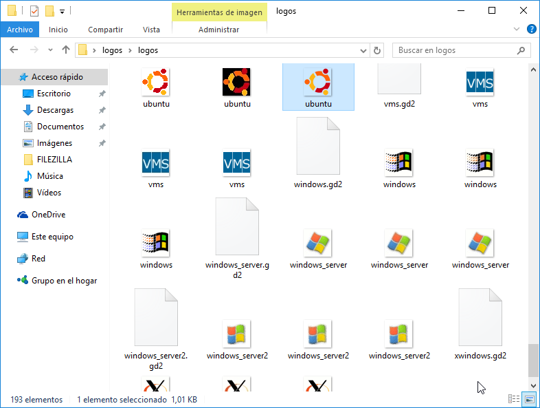

Es posible **modificar las imágenes con que se mostrarán los equipos en el mapa** presentado por Nagios. Podemos visualizar el nombre de los íconos que se mostraran en el mapa en: 

```bash
ls -l /usr/share/nagios/htdocs/images/logos | less
```

Para salir de la vista, presionar la letra **q** (quit).

## Descargando íconos desde el servidor Nagios

Otra opción interesante para **visualizar gráficamente los íconos** precargados de Nagios consiste en descargar la carpeta que los contiene desde el servidor. 

Para ello, instalaremos un **cliente FTP** como, por ejemplo, Filezilla. 

Una vez instalado el programa, hacemos clic sobre el ícono _Gestor de sitios_:


Se desplegará un cuadro de diálogo en el cual hacemos clic en _Nuevo sitio_:


Y allí completamos el formulario con los datos de nuestro servidor Nagios, según se muestra en la imagen y damos clic en _Aceptar_ para guardar los cambios. 


Si volvemos a hacer clic en el botón _Gestor de sitios_ veremos la conexión a nuestro servidor realizada con anterioridad. Hacemos clic en _Conectar_:


Como se trata de una conexión segura (SFTP) el programa nos preguntará si deseamos intercambiar claves de cifrado con el servidor. Hacemos clic en _Aceptar_:


De esta manera, en la ventana izquierda del programa veremos nuestros archivos de Windows y en la ventana derecha, la carpeta _home_ de nuestro usuario en el servidor Nagios:


A continuación nos desplazamos hacia la carpeta `/usr/share/nagios/htdocs/images/` que contiene los íconos preinstalados de Nagios que se mostrarán en la vista de mapa:


Haciendo clic derecho sobre la carpeta en cuestión podemos descargar los archivos de imagen de ícono para visualizaros con mayor comodidad:


Dentro de la carpeta de íconos, encontramos distintos tipos, donde la carpeta _base_ contiene los íconos por defecto:


Por ejemplo, el contenido de la carpeta _logos_:



Podés encontrar paquetes de íconos adicionales en las siguientes direcciones: 

* [F*Nagios Icon Pack](https://exchange.icinga.com/exchange/F*Nagios+icon+pack+(Status+Map+and+Host+View+icons))

* [Directorio de íconos en Nagios Exchange](https://exchange.nagios.org/directory/Graphics-and-Logos/Images-and-Logos)

## Definiendo íconos de la vista mapa

Nagios ofrece una vista de mapa, a la cual se accede desde la opción **Map** del menú lateral izquierdo, que permite una vista global del estado de los hosts de manera gráfica. Los íconos que representan cada _host_ pueden ser modificados convenientemente. 

Para personalizar los íconos con los que se mostrarán los _hosts_ abrimos el archivo **iconos.cfg** creado con anterioridad:

```bash
sudo vim /etc/nagios3/objetos/iconos.cfg
```

Dentro del archivo incluimos código similar al que sigue. Obviamente, deberemos adaptarlo a nuestras necesidades:

```apache
# Definiendo íconos para un equpo (individualmente)
define hostextinfo {
host_name       router1
icon_image      routerNuevo.png
icon_image_alt  Router de la sala principal
statusmap_image routerNuevo.gd2
vrml_image      routerNuevo.png
}

# Definiendo íconos para todos los miembros de un grupo
define hostextinfo {
hostgroup_name	sala1
icon_image		computer.png
icon_image_alt	Equipos de la Sala 1
statusmap_image	computer.gd2
vrml_image		computer.png
}
```

Por ejemplo, tomando un ícono entre los ofrecidos por Nagios para un _host_ llamado `windowsServer`: 

```apache
# Definiendo íconos para un equpo (individualmente)
define hostextinfo {
host_name       windowsServer
icon_image      logos/windows_server.png
icon_image_alt  Windows Server 2012
statusmap_image logos/windows_server.gd2
vrml_image      logos/windows_server.png
}

```


!!!note "Sobre los íconos"
	Los **íconos** se pueden configurar para:

	* un equipo en particular, mediante la directiva **host_name** o
	
	* para un grupo de equipos empleando la directiva **hostgroup_name**.


Por último, tendremos que [verificar la configuración y reiniciar el servidor Nagios](configuracion/#verificando-la-configuracion-y-reiniciando-nagios) para guardar los cambios que hayamos introducido.

## Creando nuestro propios íconos
Nagios aloja las imágenes (iconos) que se mostrarán en el mapa en `/usr/share/nagios/htdocs/images`. 

Dentro de esta carpeta debemos copiar nuestros iconos personalizados. 

Al crear nuestra imagen deberemos tener en cuenta el formato de la misma:

* Medida: 40x40 píxeles
* Formato: png (transparente)

Luego tendremos que convertir la imagen al resto de los formatos, todos necesarios para una correcta visualización del mapa de Nagios, a saber: `.gif` y `.gd2`. Por ejemplo, suponiendo que nuestra imagen se llama _iconoPersonalizado_, deberíamos tener al final tres versiones de la misma:  

* iconoPersonalizado.png
* iconoPersonalizado.gd2
* iconoPersonalizado.gif

### Instalando las herramientas 
Para poder realizar la conversión de formato de imágenes necesitaremos instalar las siguientes herramientas: `imagemagick`, `libgd-tools` y `netpbm`.

```bash
sudo apt-get install libgd-tools netpbm imagemagick
```

### Convirtiendo .png a .gd2

Para convertir una imagen `.png` a un icono `.gd2` ejecutamos el siguiente comando:

```bash
pngtogd2 iconoPersonalizado.png iconoPersonalizado.gd2 1 1
```

Donde _iconoPersonalizado.png_ es la imagen  `.png` que deseamos convertir e _iconoPersonalizado.gd2_ es el nombre de la imagen convertida en formato `.gd2`. El parámetro `1 1` indica que la conversión debe crearse en formato raw (crudo), y que el archivo debe crearse sin compresión.

### Convirtiendo .png a .gif
Para realizar esta conversión, simplemente ejecutamos: 

```bash
convert iconoPersonalizado.png iconoPersonalizado.gif
```

### Redimensionando nuestro icono
Es probable que nuestro icono en formato `.png` no posea la medida requerida por Nagios (40x40 pixeles) ni sea transparente. En ese caso podemos salvar la cuestión ejecutando algunos comandos en la terminal.

Convertimos la imagen al formato _netpbm_ (pnm - portable anymap format):

```bash
pngtopnm iconoPersonalizado.png > iconoPersonalizado.pnm 
```

Finalmente, redimensionamos la imagen y tornamos el fondo transparente obteniendo un nuevo archivo `.png`: 

```bash
pnmtopng -transparent =rgb:00/00/00 -phys 40 40 1 iconoPersonalizado.pnm > iconoPersonalizado.png
```

