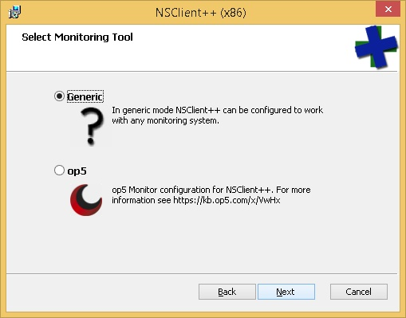
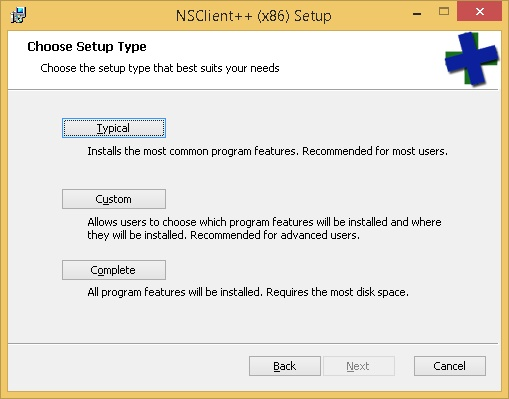
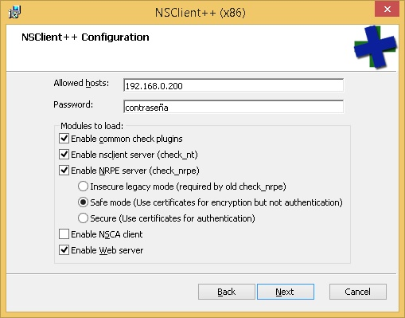
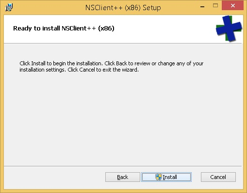
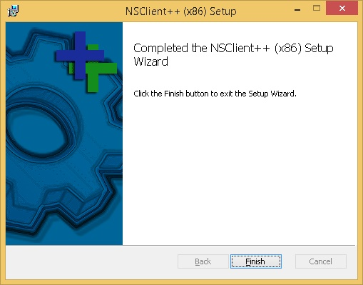

Para poder **monitorear equipos que tengan instalado el sistema operativo Microsoft Windows**, es preciso instalar en ellos un agente que se encargará de comunicarse con el servidor Nagios para enviar información sobre los mismos. Este agente es NSClient++.

## Descarga de NSClient++
Podemos descargar el agente de Nagios para Windows desde [http://www.nsclient.org/download](http://www.nsclient.org/download)

## Instalación de NSClient++ 
Una vez que hayamos descargado el programa, al hacer clic sobre el ejecutable veremos una pantalla similar a la se muestra a continuación. Hacemos clic en Siguiente para continuar:


Luego, seleccionaremos la opción de instalación genérica: 



A continuación, elegiremos la instalación típica: 



En el siguiente paso, tendremos que ingresar la **IP del servidor de Nagios** y abajo, una **contraseña a elección** (¡no olvidar!). Luego, tendremos que marcar todas las casillas de verificación, exceptuando NSCA.



Por último, continuar hasta finalizar la instalación. 






## Verificando el estado del servicio NSClient++ 
Para verificar que el servicio NSClient++ esté corriendo en el sistema Microsoft Windows, tendremos que seguir los siguientes pasos: 

* Presionamos Tecla `Windows` + `R` y luego escribimos services.msc para abrir el panel de servicios en Windows.
* Verificamos en el listado que se muestra, que el servicio _NSClient_ este iniciado y seteado como automático.
* Hacemos clic derecho sobre el servicio _NSClient_, seleccionamos la opción _Propiedades_ del menú contextual y luego elegimos la pestaña _Iniciar sesión_. Allí tildaremos la opción _Permitir que el servicio interactúe con el escritorio_. 

## Configurando el servicio NSClient++

Presionamos `Tecla Windows + R` y luego escribimos `cmd` para abrir la terminal de Windows. Desde allí nos desplazamos a la carpeta de instalación del agente de monitoreo: 

```bash
cd c:\Program Files\NSClient++
```

<WRAP center round tip 100%>
Podemos hacer clic sobre la carpeta hacia la cual nos queremos desplazar y arrastrarta hacia la terminal de comandos de Windows (abierta). De esta manera, nos desplazaremos rápidamente hacia la carpeta en cuestión. 
</WRAP>
 

Estando dentro de la carpeta en cuestión, ejecutamos en la consola de Windows: 

```bash
nscp settings --generate --add-defaults --load-all
```

## Configurando NSClient++  en el servidor Nagios

Antes de continuar, es conveniente crear una copia de seguridad del archivo que modificaremos: 

```bash
sudo cp /etc/nagios-plugins/config/nt.cfg /etc/nagios-plugins/config/nt.cfg.original
```

Acto seguido, abrimos el archivo **nt.cfg**:  

```bash
sudo vim /etc/nagios-plugins/config/nt.cfg
```

Y procederemos a modificar el archivo de tal manera que sólo debería quedarnos las siguientes líneas: 

```apache
define command {
command_name   check_nt
command_line   /usr/lib/nagios/plugins/check_nt -H $HOSTADDRESS$ -p 12489 -s contraseña -v $ARG1$ $ARG2$
}
```

Donde **contraseña**, es la clave elegida durante la instalación del agente NSClient++.

Por último, tendremos que [verificar la configuración y reiniciar el servidor Nagios](configuracion/#verificando-la-configuracion-y-reiniciando-nagios) para guardar los cambios que hayamos introducido.
