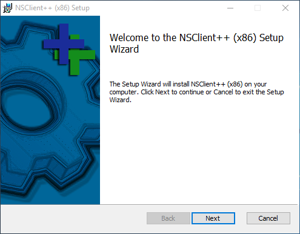
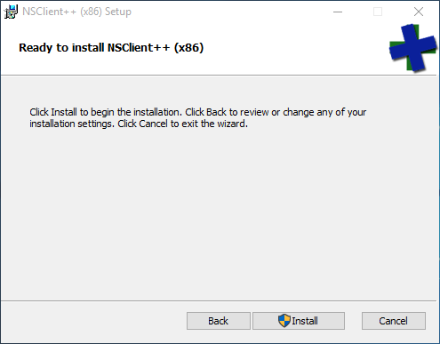
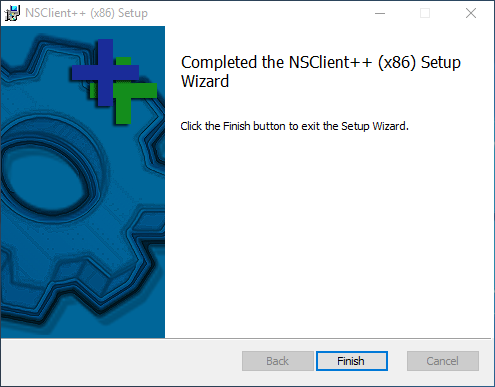
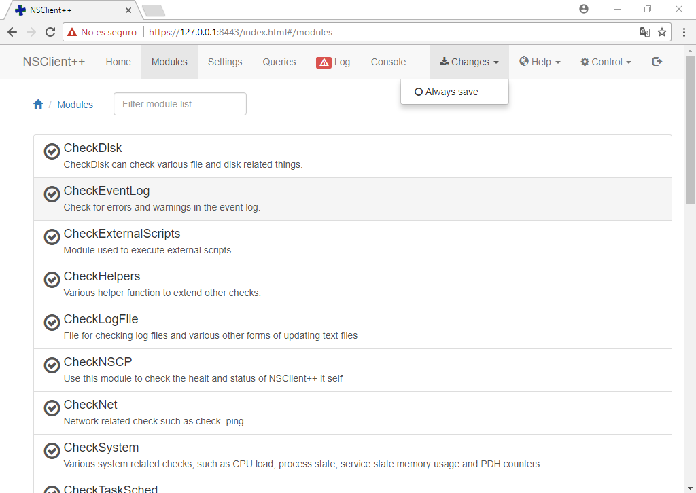

Para poder **monitorear equipos que tengan instalado el sistema operativo Microsoft Windows**, es preciso instalar en ellos un agente que se encargará de comunicarse con el servidor Nagios para enviar información sobre los mismos. Este agente es NSClient++.

## Descarga de NSClient++
Podemos descargar el agente de Nagios para Windows desde [http://www.nsclient.org/download](http://www.nsclient.org/download)

## Instalación de NSClient++ 
Una vez que hayamos descargado el programa, al hacer clic sobre el ejecutable veremos una pantalla similar a la se muestra a continuación. Hacemos clic en Siguiente para continuar:



Luego elegimos la herramienta de monitoreo:


A continuación, seleccionamos el tipo de instalación: 


Llegados a este punto, ingresar: 

* La dirección IP del servidor Nagios
* La dirección IP local (127.0.0.1)
* Una contraseña a elección que recuerdes

Luego presionaremos en botón de "Next"


En este paso, presionamos "Install"



Y comenzará la Instalación...


Segundos más tarde, la misma habrá finalizado




## Iniciando el servicio NSClient++
Para iniciar o parar el servicio de NSClient++ en Windows tendremos que abrir una terminal (como Administrador) y ejecutamos para iniciar el servicio: 

```bash
net start nscp 
```

o bien, para deternerlo:

```bash
net stop nscp 
```

Para verificar que el servicio NSClient++ esté corriendo en el sistema Microsoft Windows, tendremos que seguir los siguientes pasos: 

* En Windows abrimos una terminal en **modo administrador**. 
* Ejecutamos `services.msc`
* Verificamos en el listado que se muestra, que el servicio _NSClient_ este iniciado y seteado como automático.
* Hacemos clic derecho sobre el servicio _NSClient_, seleccionamos la opción _Propiedades_ del menú contextual y luego elegimos la pestaña _Iniciar sesión_. Allí tildaremos la opción _Permitir que el servicio interactúe con el escritorio_. 

## Configurando el servicio NSClient++

En este paso deberemos realizar varias acciones, fundamentalmente relacionados con la carga de módulos que serán los encargados de monitorear los distintos servicios en Windows

### Carga de módulos 

Abrimos la terminal de Windows en **modo administrador**. Desde allí nos desplazamos a la carpeta de instalación del agente de monitoreo: 

```bash
cd c:\Program Files\NSClient++
```

!!!tip "Acceder a la carpeta NSClient++ desde la terminal"
		Podemos hacer clic sobre la carpeta hacia la cual nos queremos desplazar y arrastrarta hacia la terminal de comandos de Windows (abierta). De esta manera, nos desplazaremos rápidamente hacia la carpeta en cuestión. 

 

Estando dentro de la carpeta en cuestión, ejecutamos en la consola de Windows: 

```bash
nscp settings --generate --add-defaults --load-all
```

!!!note "Salida del comando"
		El comando, en caso de ser correcto, no produce ninguna salida. Tampoco debemos preocuparnos si leemos el mensaje “Failed to register plugin”. 

### Habilitando módulos
Acto seguido, abrimos en **modo administrador** un editor serio (_notepaders_, abstenerse) como **Notepad++** ó **Sublime Text**, por ejemplo, abrimos el archivo `nsclient.ini` ubicado en la carpeta de instalación del programa:  


Luego, habilitamos manualmente los módulos que figuran como deshabilitados (_disabled_) de modo que el bloque quete de la siguiente manera: 

```bash
[/modules]

; Undocumented key
CheckExternalScripts = enabled

; Undocumented key
CheckNSCP = enabled

; Undocumented key
CheckEventLog = enalbled

; Undocumented key
CheckDisk = enabled

; Undocumented key
CheckSystem = enabled

; Undocumented key
CheckHelpers = enabled

; Undocumented key
WEBServer = enabled

; Undocumented key
NSClientServer = enabled

; Undocumented key
NRPEServer = enabled

```

### Verificando que los módulos estén habilitados

Adicionalmente, podremos entrar a la interfaz web de NSClient++ y verificar que dichos módulos se encuentren habilitados, a la vez que verificaremos el correcto funcionamiento del agente. 

Para ello, en Windows accederemos a la siguiente dirección: `https://127.0.0.1:8443`


Una vez allí iniciaremos sesión con la contraseña que definimos al momento de la instalación del cliente


En el menú, seleccionaremos "Modules" y _chequearemos_ aquellos que no lo estén: 


Por último, guardaremos los cambios: 




## Configurando NSClient++ en el servidor Nagios

Antes de continuar, es conveniente crear una copia de seguridad del archivo que modificaremos: 

```bash
sudo cp /etc/nagios-plugins/config/nt.cfg /etc/nagios-plugins/config/nt.cfg.original
```

Acto seguido, abrimos el archivo **nt.cfg**:  

```bash
sudo vim /etc/nagios-plugins/config/nt.cfg
```

Y procederemos a modificar el archivo de tal manera que sólo debería quedarnos las siguientes líneas: 

```apache
define command {
command_name   check_nt
command_line   /usr/lib/nagios/plugins/check_nt -H $HOSTADDRESS$ -p 12489 -s contraseña -v $ARG1$ $ARG2$
}
```

Donde **contraseña**, es la clave elegida durante la instalación del agente NSClient++.

Por último, tendremos que [verificar la configuración y reiniciar el servidor Nagios](configuracion/#verificando-la-configuracion-y-reiniciando-nagios) para guardar los cambios que hayamos introducido.
